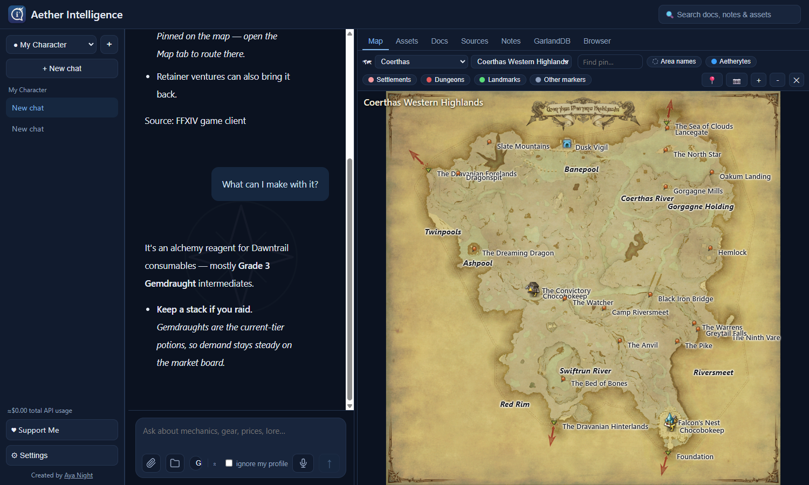
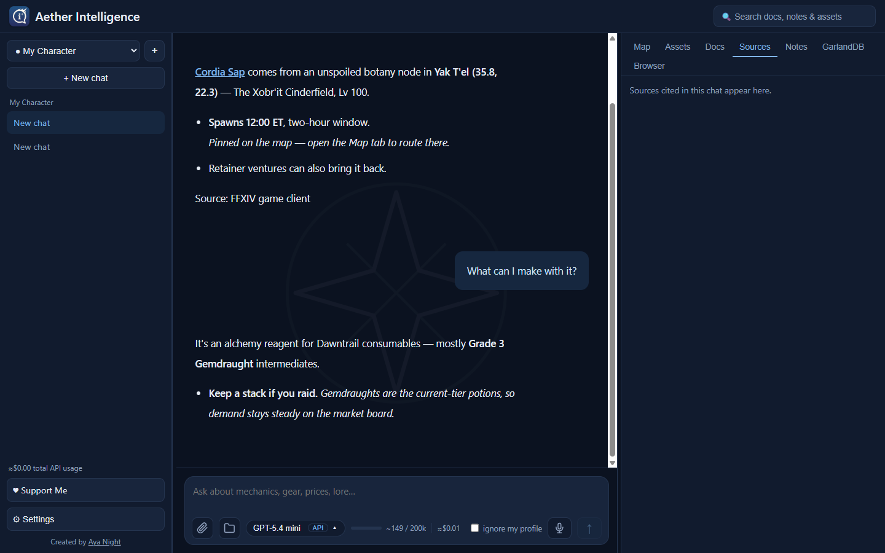
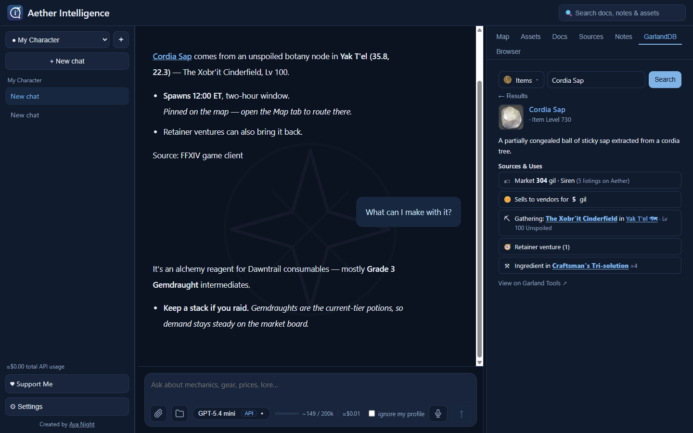
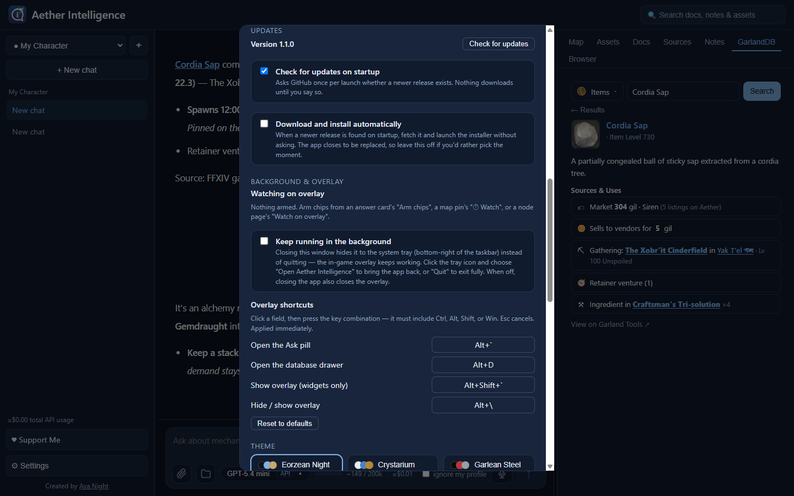
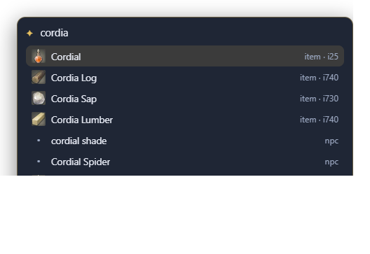

# Aether Intelligence

A desktop AI assistant for Final Fantasy XIV — chat about mechanics, gear, prices,
lore, and events, in the app or **on an overlay drawn over the running game**.
Answers come first from **your own installed game client's data files**, then from
the wikis and community APIs, every source cited. Multi-provider
(Claude, GPT, Gemini, Grok): bring your own API key, or run Claude on your Pro/Max
subscription at no per-token cost.
> ⚠ The Claude subscription path conflicts with Anthropic's usage policy for
> third-party apps (subscription OAuth is restricted to Claude Code itself) and
> may be blocked server-side. Personal use at your own risk; the API-key path is
> the compliant option.



## Average API Costs

On a **Claude Pro/Max subscription: nothing extra** — every question is covered
by the plan, and the composer shows what the chat *would* have cost at API
prices (`≈$0.12 incl.`) so you can see the value you're getting.

On an **API key** you pay per token. The agent re-sends the system prompt and
chat history each turn and reads tool results (item lookups, wiki pages,
prices), so cost tracks how much *research* a question needs — and grows as a
chat gets longer. Anthropic requests use prompt caching, which cuts repeated
context to ~10% of full price. Rough figures for a fresh chat on Claude
Sonnet 5, from the app's own estimator:

| Example question | What the agent does | Approx. cost |
|---|---|---|
| "Where do I find Cordia Sap?" | one local database lookup → pin on the interactive map | ~$0.05–0.10 |
| "What job classes have I not tried yet?" | reads your imported character profile, no web research | ~$0.05–0.10 |
| "What events are up and what rewards should I aim for?" | fetches Lodestone news, weighs rewards against your profile | ~$0.15–0.25 |
| "Create a gear upgrade path guide for my Ninja" | reads your actual gear, checks market prices, writes a doc | ~$0.35–0.60 |
| "Create an Alliance Raid guide for my Tank Class" | multi-page wiki research, long structured guide doc | ~$0.60–1.20 |

Ballpark: quick lookups are cents; full research guides approach a dollar.
Claude Haiku runs about **⅓** of these numbers, Claude Opus about **1.7×**.
The `≈$` pill at the bottom of every chat tracks the estimate live; it ignores
prompt caching, so the real bill is usually a bit lower.

## What it does

- **Plays alongside the game** — a transparent, click-through overlay you summon
  with a hotkey: ask a question without alt-tabbing, search the database, and
  keep spawn timers on screen. See [In-game overlay](#in-game-overlay).
- **Chat that researches** — the agent looks things up instead of answering from
  memory: your game client's data for items/NPCs/nodes, the wiki (including its
  data tables) for mechanics and drops, Universalis for market prices, the
  Lodestone for news. Every source is cited, and in-game things (items, NPCs,
  quests, duties, zones) are clickable links into the app. A ■ Stop button
  interrupts a streaming answer, and an "ignore my profile" switch in the
  composer gets general answers untailored to your character.
- **Reads your game client directly** — with FFXIV installed on the same PC,
  items, gathering nodes, NPCs, search, icons, and map textures come straight
  from the game's own data files (sqpack/EXD, `.tex` decoded locally): zero
  network, zero rate limits, and content that is current the moment the
  launcher finishes patching. No game on this machine? Everything falls back to
  the network sources below automatically.
- **Interactive in-game map** — rebuilt from the game's own data (textures
  composed from your client, the game's marker table via XIVAPI), covering
  every zone through Dawntrail. Region → zone dropdowns like the in-game map
  window; pan/zoom; toggleable layers (aetherytes, cities, settlements,
  dungeons, landmarks, area names); a search box that finds your pins, named
  markers, and whole zones ("uldah" works — punctuation optional).
- **Your pins** — click to place, label, and colour pins; click to select/edit;
  delete with the Delete button or Backspace while selected. When the agent or
  the database points at a spot, it drops a *temporary* pin — 📌 Keep saves it
  permanently under its own type ("Custom – Gathering" gets its own layer
  toggle, icon and all). The 📷 button saves the current view as an asset.
- **Knows your character** — imports your Lodestone profile, and reads per-job
  gear straight from the game's local `GEARSET.DAT`, so "what should I upgrade"
  is answered from what you actually wear. Per-job gear is archived as you play.
- **GarlandDB tab** — an in-app database: search everything (items, duties,
  NPCs, quests, fates …), browse catalogues with each entry's real game icon,
  see how to get an item (gathering nodes with map links, vendors, ventures,
  crafts), live market price, upgrade path, and NPC portraits pulled from the
  community wiki.
- **Docs & notes** — ask for a guide and it builds a reference doc (tables,
  checkboxes, linked items) you keep open while playing, with a per-doc chat
  thread that closes when you click away and returns when you click the ask box.
- **Built-in browser tab** — a real Chromium view in the right pane. External
  links — wiki citations, the Lodestone — open there, beside the chat, instead
  of throwing you out to another window.
- **Standing preferences** — tell the agent "from now on …" and it saves a
  one-line rule to a preferences file read into every chat. You own the file:
  Settings → Agent preferences → ✎ Open in editor.
- **Patch-aware, self-updating content** — the installed client's own version
  file is the patch signal (XIVAPI's content hash when no client is present);
  caches purge and the local index rebuilds the moment a patch lands — even
  mid-session.
- **Diagnosable** — every agent tool call is logged to `logs/agent-*.jsonl` in
  the data folder (tool, arguments, duration, outcome), so a slow or strange
  answer can be traced turn by turn.
- **Updates itself** — Settings → Updates checks this repo's GitHub Releases,
  shows what's new, and downloads + launches the installer for you. Checking on
  startup is on by default; installing without asking is opt-in.

| | |
|---|---|
|  |  |
| A cited answer, with in-game things linked into the app | The database: how to get an item, live price, gathering node |
|  | |
| Updates, overlay watches, and re-bindable shortcuts | |

## In-game overlay

A second, transparent, always-on-top window drawn over FFXIV (run the game in
**Borderless Windowed** — true fullscreen hides any overlay). It is
**click-through by default**: it never eats a click meant for the game, and only
takes the mouse and keyboard while a surface you summoned is open. Design notes
and the build plan live in [docs/overlay-spec.md](docs/overlay-spec.md).

| Shortcut | Does |
|---|---|
| `` Alt+` `` | **Ask pill** — ask the agent mid-game; the answer arrives on a compact card |
| `Alt+D` | **Database drawer** — search everything, keyboard-first (↑↓, Enter, Esc) |
| `` Alt+Shift+` `` | Show the overlay layer (chips only, no input captured) |
| `Alt+\` | Kill switch — hide or restore the whole overlay |

<p>
  <br>
  
</p>

*The pill and drawer as they're drawn — transparent, over whatever's behind
them. (Shown against the page background rather than a screenshot of the game,
since these were captured outside it.)*

All four are re-bindable in **Settings → Background & overlay**, which also holds
the overlay size and the list of everything you're watching.

- **Ask pill** — answers stream onto a small card with its sources, an
  **Open map** button when the answer is a place, and **Arm chips** to keep those
  pins on screen. Follow-up questions share one rolling chat (it appears in the
  app's sidebar under *Overlay*), and recent turns show under the pill.
- **Let it see your screen** *(opt-in, off by default)* — tick 📷 in the pill and
  each question carries one downscaled frame of the game, so "where are the aether
  currents in **this** map" resolves against what you're actually looking at. The
  frame is sent with that one question and never stored; the overlay excludes
  itself from capture, so it only ever sees the game.
- **Database drawer** — type to search, ↑↓ to walk results, Enter for a compact
  detail. From there: **Flag on map**, **Open in app**, or **⏱ Watch** to arm a
  chip (gathering nodes get their spawn windows attached automatically).
- **Chips** — armed watches on a draggable rail: node timers count down to the
  next window ("opens 20:42"), and a pin set from an answer stays as one chip.
  Click a chip to raise the app on that spot; ✕ removes it. Arm them from an
  answer card, a map pin's **⏱ Watch**, a node's page, or the drawer.
- **Keep running in the background** *(Settings)* — closing the app hides it to
  the system tray so the overlay keeps working; reopen from the tray icon. With
  it off, closing the app closes the overlay too.
- Every widget drags to wherever you want it, at any overlay size, and stays
  there.

> **On third-party tools:** Square Enix's ToS nominally prohibits them, and in
> practice tolerates overlays that don't automate gameplay or read process
> memory. This one draws on top and is fed only by data the app already has —
> plus that optional screenshot, which is pixels you can already see. It never
> reads game memory, never captures packets, and never sends input to the game.
> Personal use, at your own risk.

## Architecture

```
app/        Tauri v2 desktop shell (Rust) + React/TS frontend — three-pane UI
  src/overlay/    the in-game overlay: Ask pill, database drawer, chips
  src-tauri/      overlay.rs (transparent window, capture, screen grab,
                  global hotkeys) + the embedded browser pane
backend/    Python FastAPI sidecar: LLM providers, data sources (incl. the
            sqpack/EXD game-client reader), map engine, overlay watches,
            image annotation, per-chat storage
docs/       specs — overlay-spec.md, profile-workspaces-spec.md
scripts/    build-installer.ps1 / .sh, mirror-to-drive.ps1, start-dev.ps1
tools/      developer tools: derive_schema.py (regenerates exd_schema.json
            against a new patch), eval_facts.py (hallucination regression
            suite), sqpack_poc.py, portrait-sidecar/ (shelved 3D-render
            experiment — wiki portraits won)
```

The overlay renders the same frontend bundle as the app (`?overlay=1`) in a
second window, and talks to the same backend.

The backend runs as a local server on `127.0.0.1:8756`; the frontend talks to it
over HTTP. API keys live in the OS keychain, never on disk.

**Data lives outside the repo** when packaged (`%LOCALAPPDATA%\EorzeaAssistant`):
profiles, chats, pins, preferences, caches, the local game-data index
(`gameclient.sqlite`, rebuilt per patch), vendored supplemental data with its
license attribution (`supplemental/`), and agent logs (`logs/`). In dev the
repo root is the data dir —
those folders (`profile/`, `chats/`, `knowledge/`, `cache/`, `map_pins.json`,
`overlay_watches.json`, `app_settings.json`) are gitignored, so personal data
never lands in a commit.

## Data sources

| Source | Used for | Notes |
|---|---|---|
| Your installed FFXIV client | items, NPCs + coordinates, gathering nodes, search, **icons and map textures** (decoded from `.tex`, maps composed base × mask) — read locally from `sqpack` | primary when the game is on this PC; column schema pinned in `exd_schema.json`, validated at startup (`tools/derive_schema.py` regenerates it) |
| [Garland Tools](https://garlandtools.org/db/) | fallback for all of the above; browse/detail pages; per-record patch tags via their MIT-licensed supplemental data (vendored, pinned, attributed in `%DATA%/supplemental/`) | network fallback + curated data the client files don't carry |
| [XIVAPI v2](https://v2.xivapi.com/) | the game's own map markers, marker icons, patch/version stamp | drives the interactive map |
| [Universalis](https://universalis.app/) | market-board prices | live, never cached |
| [FFXIV Console Games Wiki](https://ffxiv.consolegameswiki.com/) | mechanics, fights, quests, drops, lore | MediaWiki API via `curl_cffi` browser impersonation at low volume |
| [The Lodestone](https://na.finalfantasyxiv.com/lodestone/) | news, patch notes, character import | official |

Citations name **whatever actually answered** — a fact read from your own game
files is cited as the FFXIV game client, not as the community database that would
have been the fallback.

Most of these are volunteer projects — the app's Sources tab links each project's
own support page next to its citations. Please support them! 

## Prerequisites

Node, Python 3.12, and Rust (MSVC toolchain on Windows).

## Running (dev)

Two processes. **Backend:**

```powershell
cd backend
.\.venv\Scripts\python.exe run_backend.py    # binds 127.0.0.1:8756
```

**Frontend** — web UI or the full desktop app:

```powershell
cd app
npm run dev          # web UI at http://localhost:1420 (fast)
npm run tauri dev    # real desktop window (first run compiles Rust)
```

Useful dev knobs: `FFXIV_BACKEND_PORT` / `FFXIV_DATA_DIR` on the backend, and
`VITE_BACKEND=http://127.0.0.1:<port>` to point a dev frontend at a non-default
backend (the packaged app always uses 8756).

Then open **Settings** in the app and add a provider key — or sign in with a
Claude subscription token (`claude setup-token`).

## Building the installer

Produce a standalone Windows installer (end users need no Python/Node/Rust):

```powershell
powershell -ExecutionPolicy Bypass -File scripts\build-installer.ps1
```

(`pwsh` works too if PowerShell 7 is installed.)

This (1) PyInstaller-compiles the backend into `backend.exe`, (2) places it as
the Tauri sidecar, and (3) runs `tauri build`. Installers land in
`app\src-tauri\target\release\bundle\` (`msi\` and `nsis\`). The Rust shell
spawns the bundled backend on launch and stops it on exit — one app.

Notes:
- The Claude **subscription** path needs Claude Code installed on the user's
  machine (the Agent SDK runs on it). The API-key path is fully self-contained.
- The installer is unsigned; see `SIGNING.md` for the code-signing plan.

### Publishing a release (so in-app updates find it)

The app's updater reads this repo's **GitHub Releases**. Tag the release with
the version (`v1.2`), and attach the NSIS installer — the one ending
`-setup.exe`. The app compares its own version against the release tag, so keep
`version` in `app/src-tauri/tauri.conf.json` in step with the tag you publish.
Nothing else is required: no update manifest, no signing key.

## Changelog

What changed in each release: [CHANGELOG.md](CHANGELOG.md).

## Contributing

This project is **source-available, not community-developed** — the code is
published to read, audit, and build for personal use. Pull requests are closed
automatically and community contributions aren't accepted (see
[CONTRIBUTING.md](CONTRIBUTING.md)). Security issues can be reported privately
via the repo's Security tab.
